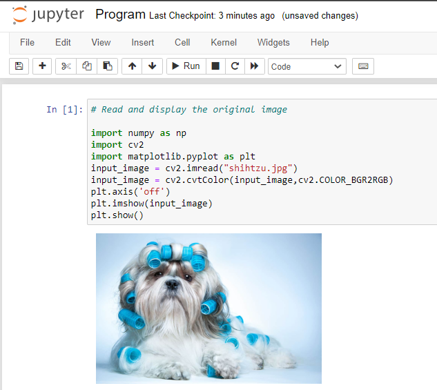
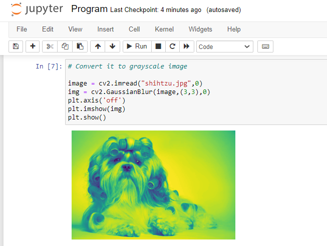
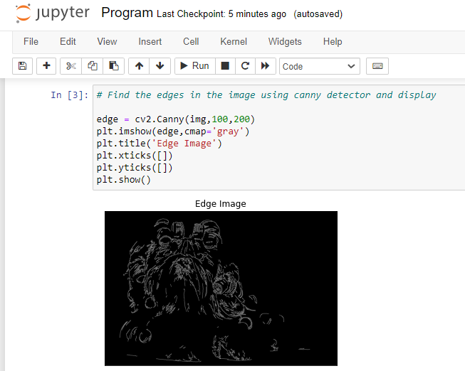
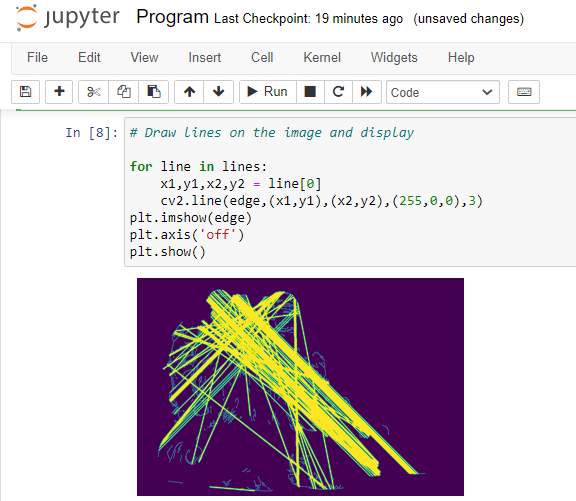

# EDGE-LINKING-USING-HOUGH-TRANSFORM
## AIM:
To write a Python program to detect the lines using Hough Transform.

## SOFTWARE REQUIRED:
Anaconda - Python 3.7

## ALGORITHM:
### Step1:
Import all the necessary modules for the program.

### Step2:
Load a image using imread() from cv2 module.

### Step3:
Convert the image to grayscale.

### Step4:
Using Canny operator from cv2,detect the edges of the image.

### Step5:
Using the HoughLinesP(),detect line co-ordinates for every points in the images.Using For loop,draw the lines on the found co-ordinates.

### Step6:
Display the image and end the program.


## PROGRAM:
Developed by : Shrruthilaya G

Register number : 212221230097

### Read and display the input image
```python
import numpy as np
import cv2
import matplotlib.pyplot as plt
input_image = cv2.imread("shihtzu.jpg")
input_image = cv2.cvtColor(input_image,cv2.COLOR_BGR2RGB)
plt.axis('off')
plt.imshow(input_image)
plt.show()
```

### Convert it to Grayscale image
```python
image = cv2.imread("shihtzu.jpg",0)
img = cv2.GaussianBlur(image,(3,3),0)
plt.axis('off')
plt.imshow(img)
plt.show()
```

### Find the edges in the image using canny detector and display
```python
edge = cv2.Canny(img,100,200)
plt.imshow(edge,cmap='gray')
plt.title('Edge Image')
plt.xticks([])
plt.yticks([])
plt.show()
```

### Detect points that form a line using HoughLinesP
```python
lines=cv2.HoughLinesP(edge,1,np.pi/180, threshold=80, minLineLength=50,maxLineGap=250)
```
### Draw lines on the image and display
```python
for line in lines:
    x1,y1,x2,y2 = line[0]
    cv2.line(edge,(x1,y1),(x2,y2),(255,0,0),3)
plt.imshow(edge)
plt.axis('off')
plt.show()
```
## OUTPUT:

### Input image 

<br>
</br>

### Grayscale image

<br>
</br>

### Canny Edge detector 

<br>
</br>

### Hough transform


## RESULT:
Thus the program is written with python and OpenCV to detect lines using Hough transform. 
